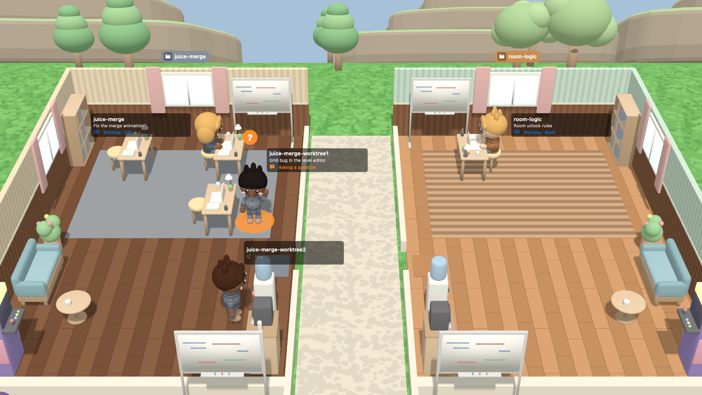

# Slash Office

[](https://github.com/egekolSlash/slash-office)

A lightweight Mac workspace for running many [Claude Code](https://docs.anthropic.com/en/docs/claude-code) agents in parallel — and a little office where you can watch them work.

Slash Office belongs to the same family as the multi-agent workspaces and agent managers: you start several Claude Code sessions across your projects, keep them side by side in split panes, see at a glance which one is working, which one is waiting for you and which one is done, jump straight to the one that needs you, resume sessions later, and review what each agent changed. It does that as a small native app — no Electron, no server, no account, and Slash Office itself sends nothing over the network.



## What it does

- **Parallel agents** — start Claude Code sessions in any project folder; each runs in its own embedded terminal. Plain terminals work too.
- **Split panes** — up to four panes; drag a session from the list (or a pane by its header) onto an edge of another pane to split it.
- **Attention routing** — every session shows whether it's working, asking a question, waiting for permission, done or stopped. Notifications and ⌘J take you to the agent that's waiting.
- **Resume** stopped sessions where they left off, including ones Claude Code keeps running in the background.
- **Review** the focused session's changes (git diff, including just its last turn) and its todo list in the inspector.
- **The office** — an optional view where every project is a room and every session a villager. A villager types while its agent works, stands up with a **?** when it needs you and shows a **✓** when it finished while you were looking elsewhere. Click a villager to open its terminal; give villagers names and their own look.
- English and Turkish.

## Lightweight by design

- Native Swift and Metal; the whole app is under 20 MB.
- Agent state comes from Claude Code hooks, so idle agents cost nothing; plain terminals are checked once a second.
- The office draws only while it's visible and stops completely when hidden or minimized. With **Energy saving** on (the default) villagers animate at 12–30 fps; the mini office in Work mode runs at 12 fps.
- Turn the office off entirely (**Settings › Office view**) and Slash Office is just a fast agent terminal.
- No background daemons, analytics or network calls of its own; your Claude Code settings are left untouched.

## Requirements

- macOS 26 (Tahoe) or later, Apple Silicon or Intel
- [Claude Code](https://docs.anthropic.com/en/docs/claude-code) (optional — without it Slash Office works as a terminal)

## Installation

### Quick install

```sh
curl -fsSL https://raw.githubusercontent.com/egekolSlash/slash-office/main/install.sh | sh
```

**How it works:** the script downloads the latest release from GitHub, checks its SHA-256 checksum, and copies `SlashOffice.app` into `/Applications` (or `~/Applications` if `/Applications` isn't writable). Files downloaded with `curl` aren't quarantined, so macOS opens the app without a Gatekeeper warning. Nothing is installed if the download or the checksum fails. Read [`install.sh`](install.sh) first if you like — it's short.

**Update:** run the same command again; it quits a running Slash Office and replaces it.

**Uninstall:** delete `SlashOffice.app` from Applications. To remove everything, also delete the settings (`~/Library/Preferences/io.github.egekolslash.slashoffice.plist`) and the session history (`~/Library/Application Support/AgentOffice`).

### Homebrew

```sh
brew tap egekolSlash/tap
brew install slash-office          # or: brew install --HEAD slash-office
```

**How it works:** the formula builds Slash Office from source on your Mac (so it needs Xcode 26) and installs the app into Homebrew's prefix. A locally built app isn't quarantined. Homebrew can't write to `/Applications`, so open it from the prefix and keep it in the Dock (right-click its Dock icon › Options › Keep in Dock):

```sh
open "$(brew --prefix)/opt/slash-office/SlashOffice.app"
```

**Update:** `brew upgrade slash-office`. **Uninstall:** `brew uninstall slash-office`.

### Build from source

```sh
git clone https://github.com/egekolSlash/slash-office.git
cd slash-office
scripts/make-app.sh                 # builds build/SlashOffice.app
open build/SlashOffice.app
```

**How it works:** `make-app.sh` runs `swift build -c release`, compiles the app icon and the String Catalog with Xcode's tools, and packages everything into an app bundle. It needs Xcode 26 (with only the Command Line Tools the app is English-only and uses the plain icon). Set `ARCHS="arm64 x86_64"` for a universal build.

**Update:** `git pull && scripts/make-app.sh`. Tests: `swift test`.

> Locally built and Quick install copies are ad-hoc signed, so macOS asks for permissions (microphone, screen recording…) again after each update.

## First launch

A short guide walks you through the language, the Claude Code check, permissions, the office and its preferences, and the shortcuts for your keyboard layout. Skip it any time; reopen it from **Help › Welcome Guide…**.

## Shortcuts

| Action | Shortcut |
|---|---|
| New Claude session | ⌘N |
| New pane / new pane beside | ⌘T / ⌘D |
| Office / Work / Focus mode | ⌘1 / ⌘2 / ⌘3 |
| Previous / next session in the focused pane | ⇧⌘↑ / ⇧⌘↓ |
| Previous / next pane | ⇧⌘← / ⇧⌘→ |
| Jump to the agent that's waiting | ⌘J |
| Resume session / resume all stopped | ⌘R / ⇧⌘R |
| Remove stopped session | ⇧⌘⌫ |
| Close pane | ⌘W |
| Customize agents (names and looks) | ⇧⌘A |
| Bigger / smaller / actual text size | ⌘+ (or ⌘=) / ⌘− / ⌘0 |

Session and pane navigation use the arrow keys, so they sit in the same place on every keyboard layout.

## Settings

- **Language** — System, English or Türkçe (applies after a restart).
- **Office view** — the animated 3D office, or simple cards that use less CPU and GPU.
- **Day and night** — the sky follows your Mac's clock.
- **Mini office auto-focus** — the small office in Work mode turns to the agent that needs you.
- **Energy saving** — on: villagers animate at 12–30 fps; off: always at your display's refresh rate. The office never draws while it's hidden.

## Permissions

All optional, requested from the guide (or **Agents › Permissions…**):

- **Full Disk Access** — stops repeated file-access prompts when agents work in Documents, Desktop or Downloads.
- **Notifications** — when an agent asks a question or needs permission.
- **Microphone** — Claude Code's voice mode.
- **Screen Recording** — lets agents in your terminals take screenshots.

## How it works

Slash Office starts each Claude session with a per-session `--settings` file that adds [hooks](https://docs.anthropic.com/en/docs/claude-code/hooks); the small `agent-office-hook` helper forwards hook events to the app over a local Unix socket. Slash Office itself sends nothing over the network, and your own Claude Code settings are not modified.

## Like it?

If Slash Office is useful to you, a ⭐ on [GitHub](https://github.com/egekolSlash/slash-office) helps other people find it.

## License

[MIT](LICENSE) © 2026 Ege Kol
